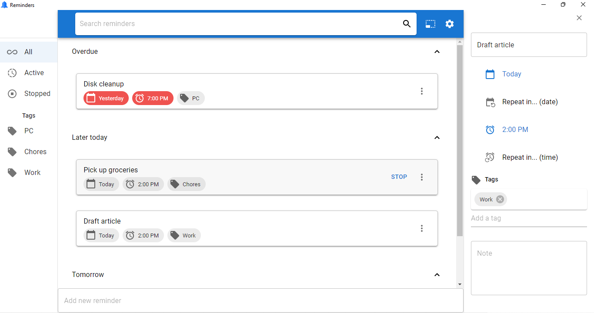

# Reminders

Beautiful cross-platform app to store all information (tasks, events, etc.) you need to remember.



## How is Reminders Different from a To-do List App?

Reminders is focused on **reminders**, not tasks. There is no concept of task completion or sub-tasks. Every reminder you add has to have a defined date and time for your being notified. When a reminder is due, you can stop it or you can let it "snooze" periodically for as long as you want.

## Features
- Beautiful and clean user interface.
- Create new reminders quickly.
- Get native desktop notifications for reminders when due.
- Keep reminders visible at all times with sticky mini mode.
- Repeat reminders throughout the day (every X minutes or hours).
- Repeat reminders every X days (weeks, months, or years).
- Fast forward reminders by day or time.
- Categorize reminders with multiple tags.
- Run app at startup to keep getting reminders on computer restart.
- Continue getting regular "snooze" notifications once a reminder is due.
- Get notifications for reminders you missed (when your computer was turned off).
- Easily edit reminder details.
- Add more information for reminders with notes.
- More features coming soon.

## Tech Stack
- React (+ MobX)
- Electron

## Contributing

All feedback and suggestions are welcome. You can send one by creating a [new issue](https://github.com/tariibaba/reminders/issues/new).

### Running from Source

Fork the repo and clone your fork:

```git clone https://github.com/<<<your-github-account>>>/beveldm```

Go to the project folder in a terminal instance and install dependences:

```yarn install```

Start React:

```yarn rstart```

Start Electron in a new terminal instance:

```yarn dev```
